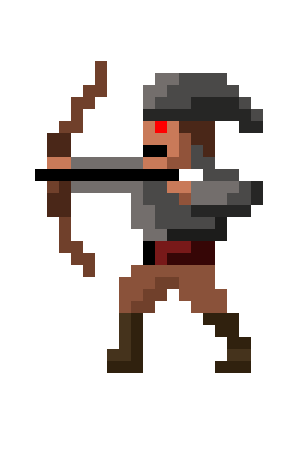

#  Dungeons & Objects

UTN - Facultad Regional Buenos Aires - Materia Paradigmas de Programación

## Equipo de desarrollo: 

- Brian Cesar Sisco Salazar
- Ignacio Emanuel Rodriguez Martín
- Matías Goldberg 
- Matías Gabriel Hoz
- Valentín Fernández Pizzella
 

## Capturas 

## Reglas de Juego / Instrucciones

 Eres un valiente caballero adentrándose en una mazmorra. Deberás sortear los obstáculos que se te presenten en busqueda de la llave que te permita llegar al tesoro. Cuidado, la mazmorra guarda temibles criaturas que harán que tu camino no sea para nada fácil
 Pero no todo es malo, si la suerte te acompaña, puedes encontrar equipamientos de antiguos aventureros que te fortalezcan para llegar preparado a combatir al dragón
 Muchos peligros, un objetivo, estás preparado?

## Controles:

- `W` Ir hacia arriba
- `A` Ir hacia la izquierda
- `S` Ir hacia abajo
- `D` Ir hacia la derecha
- `E` Agarrar objeto
- `space` Disparar flecha 
